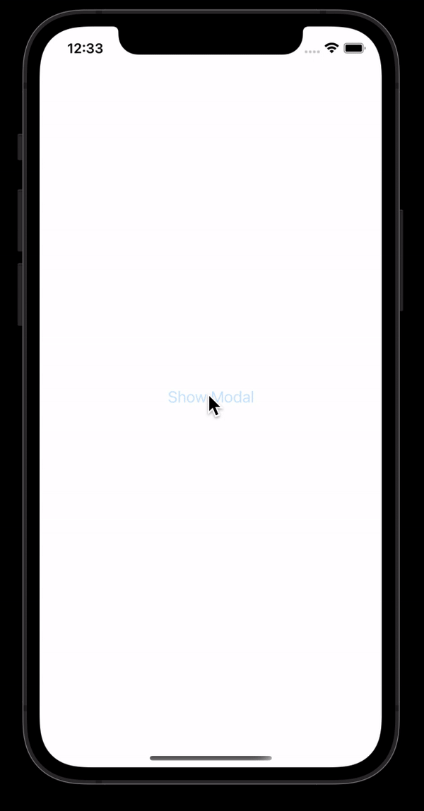

# React Native Slide Modal

[](https://badge.fury.io/js/react-native-slide-modal)
[](https://www.npmjs.com/package/react-native-slide-modal)

*  [Features](#features)
*  [Built With](#built-with)
*  [Pending Items](#pending-items)
*  [Screenshot (iOS)](#screenshot-ios)
*  [Screenshot (Android)](#screenshot-android)
*  [Getting Started](#getting-started)
*  [Props](#props)
*  [Example App](#example-app)
*  [Building & Publishing](#building-&-publishing)
*  [Changelog](#changelog)


## Features
*  ✅ iOS/Android
*  ✅ Dark Mode
*  ✅ Built with TypeScript
*  ✅ Built with React Hooks
*  ✅ Lightweight (0 Third Party Libraries)


## Built With
* [TypeScript](https://github.com/microsoft/TypeScript) - Programming Language
* [React Hooks](https://reactjs.org/docs/hooks-intro.html) - Functional Component State/Lifecycle Methods
* [React Native](https://facebook.github.io/react-native/) - Mobile (iOS/Android) Framework


## Pending Items
- [ ] 


## Screenshot (iOS)
**Bottom Sheet**
<div align="center">
  
</div>

**Form Sheet**
<div align="center">
  
</div>

## Screenshot (Android)
<div align="center">
  <!--  -->
</div>


## Getting Started
**1. Install Package:**
```
npm i react-native-slide-modal
```

**2. Add Example Code:**
```typescript
// Imports: Dependencies
import React, { useState } from 'react';
import { Button, Text } from 'react-native';
import { SlideModal }  from 'react-native-slide-modal';

// App
const App: React.FC = (): JSX.Element => {
  // React Hooks: State
  const [ modalVisible, setModalVisible ] = useState<boolean>(false);

  return (
    <SlideModal
      modalType="iOS Form Sheet"
      // modalType="iOS Bottom Sheet"
      modalVisible={modalVisible}
      screenContainer={
        <>
          <Button
            title="Show Modal"
            onPress={() => setModalVisible(!modalVisible)}
          />
        </>
      }
      modalContainer={
        <>
          <Text>Modal Content</Text>
        </>
      }
      modalHeaderTitle="Header Title"
      pressDone={() => setModalVisible(!modalVisible)}
      pressCancel={() => setModalVisible(!modalVisible)}
      darkMode={false}
      doneDisabled={false}
    />
  );
};

// Exports
export default App;
```

**3. Run Project:**

**Android**
```javascript
react-native run-android
```

**iOS**
```javascript
react-native run-ios
```


## Props

**Default:**
| Property            |   Type         |  Default                | Description                                                            |
| ------------------- | :------------: | :---------------------: | ---------------------------------------------------------------------- |
| `screenContainer`   | `JSX.Element`  | `<></>`                 | Screen content                                                         |
| `modalContainer`    | `JSX.Element`  | `<></>`                 | Modal content                                                          |
| `modalType`         | `ModalType`    | `'iOS Bottom Sheet'`    | Modal slide type ('iOS Bottom Sheet' or 'iOS Form Sheet')              |
| `modalVisible`      | `boolean`      | `false`                 | Modal visible                                                          |
| `pressCancel`       | `() => void`   | `undefined`             | onPress for Cancel button                                              |
| `pressDone`         | `() => void`   | `undefined`             | onPress for Done button                                                |
| `doneDisabled`      | `boolean`      | `false`                 | Disable Done button                                                    |


**Optional:**
| Property                            |   Type                         |  Default     | Description                                                            |
| ----------------------------------- | :----------------------------: | :----------: | ---------------------------------------------------------------------- |
| `darkMode`                          | `boolean`                      | `false`      | Dark mode                                                              |
| `modalHeaderTitle`                  | `string`                       | `''`         | Modal header title                                                     |
| `customStyleContainer`              | `ContainerStyle`               | iOS Theme    | Styling for container                                                  |
| `customStyleModalHeaderContainer`   | `ModalHeaderContainerStyle`    | iOS Theme    | Styling for modal header container                                     |
| `customStyleCancelText`             | `CancelTextStyle`              | iOS Theme    | Styling for cancel text                                                |
| `customStyleDoneText`               | `DoneTextStyle`                | iOS Theme    | Styling for done text                                                  |
| `customStyleModalContentContainer`  | `ModalContentContainerStyle`   | iOS Theme    | Styling for modal content container                                    |
| `customStylePickerItemText`         | `PickerItemTextStyle`          | iOS Theme    | Styling for picker item text                                           |


## Example App
**1. Open Example App:**
```
cd ExampleApp
```

**2. Run Simulator:**

**Android**
```javascript
react-native run-android
```

**iOS**
```javascript
react-native run-ios
```


## Building & Publishing

**Build**
```javascript
npm run build
```

**Publish**
```javascript
npm publish
```


## Changelog

### [0.0.31] - 5/22/2021

***Removed***

Removed `react-native-typescript-transformer` as dependency.

### [0.0.28] - 5/20/2021

***Added***

- Added `assets` to exclude in `tsconfig.json`.

***Changed***

- Updating `tsconfig.json`.
- Updating `peerDependencies` in `package.json`.

***Removed***

- Removed `types` to exclude in `tsconfig.json`.

### [0.0.27] - 5/20/2021

***Added***

- Added Props section to `README`.
- Added Example App section to `README`.

***Changed***

- Changed file structure.
- Changed `index.js` to `index.tsx`.
- Changed `package.json` build script to `cd src && tsc && cp ../package.json && Echo Build completed!`.

***Removed***

- Removed `yalc` as a global dependency.

### [0.0.20] - 5/19/2021

***Added***

- Added `yalc` as a global dependency, so `yalc publish` can be used.

### [0.0.19] - 5/18/2021

***Changed***

- Changed `inlineRequires: true` to `inlineRequires: false` in `metro.config.js`.

### [0.0.17] - 5/18/2021

***Changed***

- Changed `compilerOptions.jsx` from `react` to `react-jsx`.

### [0.0.16] - 5/18/2021

***Removed***

- Removed `import React from 'react'`.

### [0.0.15] - 5/18/2021

***Changed***

- Changing `"lib": ["es2017"]` to `"lib": ["es2015"]` in `tsconfig.json`.

### [0.0.12] - 5/18/2021

***Changed***

- Changing import from `import React from 'react';` to `import * as React from 'react';`.

### [0.0.11] - 5/18/2021

***Changed***

- Updated NPM `dependencies`.

### [0.0.9] - 5/18/2021

***Changed***

- Changed `alignContent` from `react` to `alignItems`.
- Changed `compilerOptions.jsx` from `react` to `react-jsx`.

### [0.0.8] - 5/18/2021

***Changed***

- Changed `compilerOptions.jsx` from `react-jsx` to `react`.

### [0.0.7] - 5/18/2021

***Changed***

- Added `@types/react` as `devDependencies`.

### [0.0.6] - 5/18/2021

***Changed***

- Changed `compilerOptions.jsx` from `react-native` to `react-jsx`.

### [0.0.5] - 5/18/2021

***Changed***

- Updated `typescript`.

### [0.0.4] - 5/18/2021

***Added***

- Added `react` and `react-native` as dependencies.

### [0.0.3] - 5/18/2021

***Added***

- Added `README` screenshots.

### [0.0.2] - 5/18/2021

***Added***

- Added `README` example code.


### [0.0.1] - 5/18/2021

***Added***

- Added `SlideModal` component (`iOS Bottom Sheet`, `iOS Form Sheet`).
